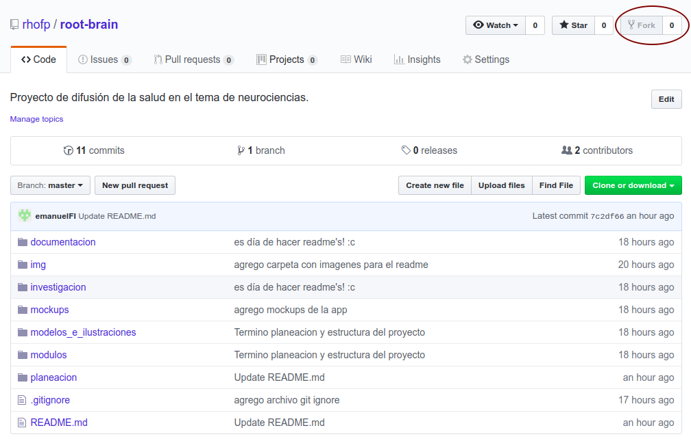

# Git workflow

El modelo desarrollo que seguiremos tendrá 2 ramas **principales ** cuya vida (duración) será infinita.

* `master`
* `develop`


Adicional a ello vamos a tener **ramas de apoyo** cuya vida será finita y propablemente se destruirán en cuando haya cumplido su propósito. La ramas secundarias que utilizaremos serán 

* rama feature, también conocida como temática.
  * Ustedes podrían tener por ejemplo, una rama llamada `frontend` en donde pues solo se trabajan cosas relacionadas con el frontend de la aplicación
* rama release
  * De esta se encarga el administrador pero podriamos tener ejemplos com `release-1.0`
* rama hotfix
  * So ramas para corregir errores que ya estaban en la rama de producción o `master` de forma urgente, es decir sin pasar a la `develop` y luego a una rama temática, ... Un ejemplo podría ser `hotfix-1.0`

Significa que al final del día nuestro desarrollo se verá más o menos así


Como pueden observar NADIE se mete con la rama master, esta rama es solo para *producción*, es decir, aquí solo se ponen las versiones más estables y que ha sido debidamente testeadas.

## ¡A trabajar!

### *Fork* del repositorio principal

Deben realizar un *fork* o copia del repositorio. La copia se hace mediante el botón `Fork` que se encuentra en la esquina superior derecha.



Una vez realizado el fork notarás que, en la parte superior izquierda, en vez de mostrar mi nombre mostrará con tu nombre de usuario.

### Clonar el repositorio

Después de realizar el *fork* deben *clonar* el repositorio.

### Configura tu copia local para seguir al repositorio raíz

Siempre que vayan a empezar a trabajar en su copia de repositorio tienen que asegurarse que poseen la última versión del repositorio original (o sea el mío) para ello deben indicar a su repositorio que estarán siguiendo una *rama remota*. El comando para ello es el siguiente.

```shell
$ git remote add --track develop rhofp https://github.com/rhofp/root-brain
```

Bueno, eso de ponerle rhofp no es necesariamente así, podrián ponerle `upstream` por convención. Solo tengan cuidado a la hora de hacer el pull.

Y para tener la versión más actual de la rama `develop` de mi repositorio tendrían que tirar el siguiente comando.

```shell
git pull rhofp develop
```

### Rama temática

Ahora, ya que poseen la última versión de la rama `develop` tienen que crear una rama con un nombre tal que represente su contribución, por ejemplo, `frontend`, el comando para crear una rama y cambiarse a ella es

```shell
git checkout -b frontend
```

Una vez realizado todos sus cambios deben subir su trabajo a su repositorio en Github para lo cual tiran el siguiente comando, obviamente me salto la parte de agregar los archivos ya hacer commits.

```sh
git push origin frontend
```

Y posteriormente se vuelven a cambiar a la rama `develop`con el siguiente comando. 

```shell
git checkout develop
```

Ya que se cambian podrían empezar a desarrollar otro módulo de la aplicación creando otra rama temática.

### *Pull request*

Trabajaremos todos su avances mediante *pull request* para que un mediador (yo) pueda cuidar la integridad del repositorio de una mejor manera.

Entonces, una vez que subimos nuestra rama a Github deben presionar el botón del **pull request** y el resto es historia ... o sea ya me toca a mi hacer el `merge` de sus cambios.

Si ya incorpore sus cambios no olviden ir borrando sus ramas.

```shell
git push origin --delete frontend
```

## Bibliografía

Pueden encontrar más información del modelo de ramas de git en el siguiente enlace <https://nvie.com/posts/a-successful-git-branching-model/>